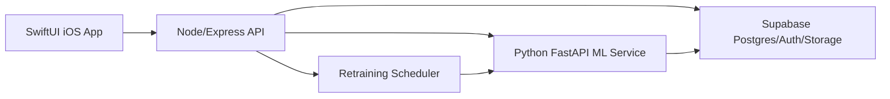

# Architecture

## Ownership

- SwiftUI owns presentation, local-first workflows, role-aware visibility, and API contracts.
- Node owns authentication, authorization, validation, CRUD, uploads, dashboard aggregation, and orchestration.
- Python owns prediction, optimization, training, and drift analysis.
- Supabase owns persistence, Auth, private storage, organization tenancy, and RLS.

## Request Flow

1. The user signs in and the app sends a bearer token to Node.
2. Node validates the token and resolves organization permissions.
3. The app loads the dashboard and permission-aware workflows.
4. Node reads/writes project records and delegates ML work to FastAPI.
5. Private files are uploaded through Node and stored in project-scoped buckets.
6. Retraining promotes validated best models into the registry.
